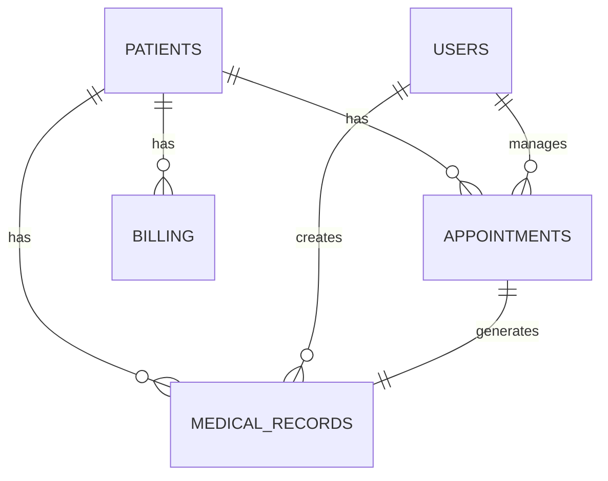

# Developer Documentation

This guide provides technical information for developers working with or extending Hospital360.

## 📋 Table of Contents

- [Architecture Overview](#architecture-overview)
- [Development Environment](#development-environment)
- [Database Schema](#database-schema)
- [API Development](#api-development)
- [Frontend Development](#frontend-development)
- [Security Guidelines](#security-guidelines)
- [Testing Framework](#testing-framework)
- [Deployment Guide](#deployment-guide)
- [Contributing Guidelines](#contributing-guidelines)

## 🏗️ Architecture Overview

Hospital360 follows a modern microservices architecture designed for scalability and maintainability.

### System Architecture

```
┌─────────────────┐    ┌──────────────────┐    ┌─────────────────┐
│   Load Balancer │    │   Web Gateway    │    │   API Gateway   │
│    (Nginx)      │────│   (React/Vue)    │────│   (Node.js)     │
└─────────────────┘    └──────────────────┘    └─────────────────┘
                                                         │
                       ┌─────────────────────────────────┼─────────────────────────────────┐
                       │                                 │                                 │
               ┌───────▼────────┐              ┌────────▼────────┐              ┌────────▼────────┐
               │  Patient        │              │  Appointment    │              │  Billing        │
               │  Service        │              │  Service        │              │  Service        │
               │  (Node.js)      │              │  (Node.js)      │              │  (Node.js)      │
               └────────────────┘              └─────────────────┘              └─────────────────┘
                       │                                 │                                 │
               ┌───────▼────────┐              ┌────────▼────────┐              ┌────────▼────────┐
               │  PostgreSQL     │              │  PostgreSQL     │              │  PostgreSQL     │
               │  Patient DB     │              │  Schedule DB    │              │  Finance DB     │
               └─────────────────┘              └─────────────────┘              └─────────────────┘
```

### Technology Stack

#### Backend
- **Runtime**: Node.js 18+ LTS
- **Framework**: Express.js 4.18+
- **Database**: PostgreSQL 12+ (primary), Redis (caching)
- **Authentication**: JWT, OAuth 2.0
- **API**: RESTful APIs, GraphQL
- **Message Queue**: Redis/RabbitMQ
- **File Storage**: AWS S3 or local filesystem

#### Frontend
- **Framework**: React 18+ or Vue.js 3+
- **State Management**: Redux/Zustand or Vuex/Pinia
- **UI Components**: Material-UI or Ant Design
- **Build Tools**: Webpack 5+ or Vite
- **Styling**: SCSS/CSS Modules or Tailwind CSS

#### DevOps
- **Containerization**: Docker & Docker Compose
- **Orchestration**: Kubernetes (optional)
- **CI/CD**: GitHub Actions or GitLab CI
- **Monitoring**: Prometheus, Grafana
- **Logging**: ELK Stack (Elasticsearch, Logstash, Kibana)

## 💻 Development Environment

### Prerequisites

```bash
# Required software
node --version    # v18.0.0 or higher
npm --version     # v8.0.0 or higher
git --version     # v2.30.0 or higher
docker --version  # v20.0.0 or higher
```

### Local Setup

```bash
# Clone the repository
git clone https://github.com/hospital360/hospital360.git
cd hospital360

# Install dependencies
npm install

# Copy environment configuration
cp .env.example .env.local

# Start development database
docker-compose up -d postgres redis

# Run database migrations
npm run db:migrate

# Seed development data
npm run db:seed:dev

# Start development server
npm run dev
```

### Project Structure

```
hospital360/
├── src/
│   ├── api/                 # API route handlers
│   │   ├── controllers/     # Business logic controllers
│   │   ├── middleware/      # Express middleware
│   │   ├── routes/          # API route definitions
│   │   └── validators/      # Input validation schemas
│   ├── config/              # Configuration files
│   ├── database/            # Database related files
│   │   ├── migrations/      # Database migration files
│   │   ├── models/          # Sequelize/Prisma models
│   │   └── seeders/         # Database seed files
│   ├── services/            # Business logic services
│   ├── utils/               # Utility functions
│   └── app.js              # Express application setup
├── client/                  # Frontend application
│   ├── public/              # Static files
│   ├── src/
│   │   ├── components/      # Reusable UI components
│   │   ├── pages/           # Page components
│   │   ├── hooks/           # Custom React hooks
│   │   ├── services/        # API service functions
│   │   ├── store/           # State management
│   │   └── utils/           # Utility functions
│   └── package.json
├── tests/                   # Test files
│   ├── unit/                # Unit tests
│   ├── integration/         # Integration tests
│   └── e2e/                 # End-to-end tests
├── docker/                  # Docker configuration
├── docs/                    # Documentation
├── scripts/                 # Utility scripts
└── package.json
```

## 🗄️ Database Schema

### Core Entities

#### Patients Table

```sql
CREATE TABLE patients (
    id SERIAL PRIMARY KEY,
    patient_id VARCHAR(20) UNIQUE NOT NULL,
    first_name VARCHAR(50) NOT NULL,
    last_name VARCHAR(50) NOT NULL,
    email VARCHAR(100) UNIQUE,
    phone VARCHAR(15),
    date_of_birth DATE NOT NULL,
    gender VARCHAR(10),
    address JSONB,
    emergency_contact JSONB,
    insurance_info JSONB,
    created_at TIMESTAMP DEFAULT CURRENT_TIMESTAMP,
    updated_at TIMESTAMP DEFAULT CURRENT_TIMESTAMP
);
```

#### Appointments Table

```sql
CREATE TABLE appointments (
    id SERIAL PRIMARY KEY,
    patient_id INTEGER REFERENCES patients(id),
    doctor_id INTEGER REFERENCES users(id),
    appointment_date DATE NOT NULL,
    appointment_time TIME NOT NULL,
    duration INTEGER DEFAULT 30,
    type VARCHAR(50) NOT NULL,
    status VARCHAR(20) DEFAULT 'scheduled',
    notes TEXT,
    created_at TIMESTAMP DEFAULT CURRENT_TIMESTAMP,
    updated_at TIMESTAMP DEFAULT CURRENT_TIMESTAMP
);
```

#### Medical Records Table

```sql
CREATE TABLE medical_records (
    id SERIAL PRIMARY KEY,
    patient_id INTEGER REFERENCES patients(id),
    doctor_id INTEGER REFERENCES users(id),
    visit_date DATE NOT NULL,
    diagnosis TEXT,
    treatment TEXT,
    medications JSONB,
    lab_results JSONB,
    notes TEXT,
    created_at TIMESTAMP DEFAULT CURRENT_TIMESTAMP,
    updated_at TIMESTAMP DEFAULT CURRENT_TIMESTAMP
);
```

### Database Relationships



## 🔌 API Development

### RESTful API Design

#### Standard Endpoints

```javascript
// Patient endpoints
GET    /api/v1/patients           # List patients
POST   /api/v1/patients           # Create patient
GET    /api/v1/patients/:id       # Get patient
PUT    /api/v1/patients/:id       # Update patient
DELETE /api/v1/patients/:id       # Delete patient

// Nested resources
GET    /api/v1/patients/:id/appointments
POST   /api/v1/patients/:id/appointments
GET    /api/v1/patients/:id/medical-records
```

#### Controller Example

```javascript
// controllers/patientsController.js
const Patient = require('../database/models/Patient');
const { validationResult } = require('express-validator');

class PatientsController {
  async index(req, res) {
    try {
      const { page = 1, limit = 10, search } = req.query;
      const offset = (page - 1) * limit;
      
      const whereClause = search ? {
        [Op.or]: [
          { first_name: { [Op.iLike]: `%${search}%` } },
          { last_name: { [Op.iLike]: `%${search}%` } },
          { patient_id: { [Op.iLike]: `%${search}%` } }
        ]
      } : {};
      
      const patients = await Patient.findAndCountAll({
        where: whereClause,
        limit: parseInt(limit),
        offset: parseInt(offset),
        order: [['created_at', 'DESC']]
      });
      
      res.json({
        status: 'success',
        data: patients.rows,
        pagination: {
          current_page: parseInt(page),
          per_page: parseInt(limit),
          total: patients.count,
          total_pages: Math.ceil(patients.count / limit)
        }
      });
    } catch (error) {
      res.status(500).json({
        status: 'error',
        error: {
          code: 'SERVER_ERROR',
          message: 'Failed to retrieve patients'
        }
      });
    }
  }
  
  async store(req, res) {
    try {
      const errors = validationResult(req);
      if (!errors.isEmpty()) {
        return res.status(422).json({
          status: 'error',
          error: {
            code: 'VALIDATION_ERROR',
            message: 'Validation failed',
            details: errors.array()
          }
        });
      }
      
      const patient = await Patient.create(req.body);
      
      res.status(201).json({
        status: 'success',
        data: patient
      });
    } catch (error) {
      if (error.name === 'SequelizeUniqueConstraintError') {
        return res.status(409).json({
          status: 'error',
          error: {
            code: 'DUPLICATE_PATIENT',
            message: 'Patient with this email already exists'
          }
        });
      }
      
      res.status(500).json({
        status: 'error',
        error: {
          code: 'SERVER_ERROR',
          message: 'Failed to create patient'
        }
      });
    }
  }
}

module.exports = new PatientsController();
```

### Middleware Examples

#### Authentication Middleware

```javascript
// middleware/auth.js
const jwt = require('jsonwebtoken');
const User = require('../database/models/User');

const authMiddleware = async (req, res, next) => {
  try {
    const authHeader = req.headers.authorization;
    
    if (!authHeader || !authHeader.startsWith('Bearer ')) {
      return res.status(401).json({
        status: 'error',
        error: {
          code: 'MISSING_TOKEN',
          message: 'Authorization token required'
        }
      });
    }
    
    const token = authHeader.substring(7);
    const decoded = jwt.verify(token, process.env.JWT_SECRET);
    
    const user = await User.findByPk(decoded.userId);
    if (!user) {
      return res.status(401).json({
        status: 'error',
        error: {
          code: 'INVALID_TOKEN',
          message: 'Invalid or expired token'
        }
      });
    }
    
    req.user = user;
    next();
  } catch (error) {
    res.status(401).json({
      status: 'error',
      error: {
        code: 'AUTHENTICATION_FAILED',
        message: 'Authentication failed'
      }
    });
  }
};

module.exports = authMiddleware;
```

## 🎨 Frontend Development

### Component Structure

```javascript
// components/PatientCard.jsx
import React from 'react';
import { Card, CardContent, Typography, Button } from '@mui/material';
import { formatDate } from '../utils/dateUtils';

const PatientCard = ({ patient, onEdit, onDelete }) => {
  const handleEdit = () => onEdit(patient.id);
  const handleDelete = () => onDelete(patient.id);
  
  return (
    <Card className="patient-card">
      <CardContent>
        <Typography variant="h6" component="h3">
          {patient.first_name} {patient.last_name}
        </Typography>
        <Typography color="textSecondary" gutterBottom>
          ID: {patient.patient_id}
        </Typography>
        <Typography variant="body2">
          DOB: {formatDate(patient.date_of_birth)}
        </Typography>
        <Typography variant="body2">
          Phone: {patient.phone}
        </Typography>
        
        <div className="patient-actions">
          <Button size="small" onClick={handleEdit}>
            Edit
          </Button>
          <Button size="small" color="error" onClick={handleDelete}>
            Delete
          </Button>
        </div>
      </CardContent>
    </Card>
  );
};

export default PatientCard;
```

### State Management

```javascript
// store/slices/patientsSlice.js
import { createSlice, createAsyncThunk } from '@reduxjs/toolkit';
import { patientAPI } from '../../services/api';

export const fetchPatients = createAsyncThunk(
  'patients/fetchPatients',
  async ({ page = 1, search = '' }, { rejectWithValue }) => {
    try {
      const response = await patientAPI.getPatients({ page, search });
      return response.data;
    } catch (error) {
      return rejectWithValue(error.response.data);
    }
  }
);

const patientsSlice = createSlice({
  name: 'patients',
  initialState: {
    data: [],
    loading: false,
    error: null,
    pagination: {
      current_page: 1,
      per_page: 10,
      total: 0,
      total_pages: 0
    }
  },
  reducers: {
    clearError: (state) => {
      state.error = null;
    }
  },
  extraReducers: (builder) => {
    builder
      .addCase(fetchPatients.pending, (state) => {
        state.loading = true;
        state.error = null;
      })
      .addCase(fetchPatients.fulfilled, (state, action) => {
        state.loading = false;
        state.data = action.payload.data;
        state.pagination = action.payload.pagination;
      })
      .addCase(fetchPatients.rejected, (state, action) => {
        state.loading = false;
        state.error = action.payload;
      });
  }
});

export const { clearError } = patientsSlice.actions;
export default patientsSlice.reducer;
```

## 🔐 Security Guidelines

### Input Validation

```javascript
// validators/patientValidator.js
const { body, param } = require('express-validator');

const createPatientValidator = [
  body('first_name')
    .trim()
    .isLength({ min: 1, max: 50 })
    .withMessage('First name is required and must be less than 50 characters'),
  
  body('last_name')
    .trim()
    .isLength({ min: 1, max: 50 })
    .withMessage('Last name is required and must be less than 50 characters'),
  
  body('email')
    .optional()
    .isEmail()
    .normalizeEmail()
    .withMessage('Valid email address required'),
  
  body('phone')
    .optional()
    .matches(/^\+?[1-9]\d{1,14}$/)
    .withMessage('Valid phone number required'),
  
  body('date_of_birth')
    .isISO8601()
    .toDate()
    .withMessage('Valid date of birth required')
];
```

### Data Sanitization

```javascript
// utils/sanitization.js
const DOMPurify = require('isomorphic-dompurify');

const sanitizeInput = (input) => {
  if (typeof input === 'string') {
    return DOMPurify.sanitize(input, { ALLOWED_TAGS: [] });
  }
  return input;
};

const sanitizeObject = (obj) => {
  const sanitized = {};
  for (const [key, value] of Object.entries(obj)) {
    if (typeof value === 'object' && value !== null) {
      sanitized[key] = sanitizeObject(value);
    } else {
      sanitized[key] = sanitizeInput(value);
    }
  }
  return sanitized;
};

module.exports = { sanitizeInput, sanitizeObject };
```

## 🧪 Testing Framework

### Unit Testing

```javascript
// tests/unit/controllers/patientsController.test.js
const request = require('supertest');
const app = require('../../../src/app');
const Patient = require('../../../src/database/models/Patient');

jest.mock('../../../src/database/models/Patient');

describe('PatientsController', () => {
  beforeEach(() => {
    jest.clearAllMocks();
  });
  
  describe('GET /api/v1/patients', () => {
    it('should return paginated list of patients', async () => {
      const mockPatients = [
        { id: 1, first_name: 'John', last_name: 'Doe' },
        { id: 2, first_name: 'Jane', last_name: 'Smith' }
      ];
      
      Patient.findAndCountAll.mockResolvedValue({
        rows: mockPatients,
        count: 2
      });
      
      const response = await request(app)
        .get('/api/v1/patients')
        .set('Authorization', 'Bearer valid-token')
        .expect(200);
      
      expect(response.body.status).toBe('success');
      expect(response.body.data).toEqual(mockPatients);
      expect(response.body.pagination.total).toBe(2);
    });
  });
});
```

### Integration Testing

```javascript
// tests/integration/patients.test.js
const request = require('supertest');
const app = require('../../src/app');
const { sequelize } = require('../../src/database');

describe('Patients API Integration', () => {
  beforeAll(async () => {
    await sequelize.sync({ force: true });
  });
  
  afterAll(async () => {
    await sequelize.close();
  });
  
  describe('Patient CRUD operations', () => {
    it('should create, read, update, and delete a patient', async () => {
      const patientData = {
        first_name: 'John',
        last_name: 'Doe',
        email: 'john.doe@example.com',
        date_of_birth: '1990-01-01'
      };
      
      // Create patient
      const createResponse = await request(app)
        .post('/api/v1/patients')
        .send(patientData)
        .expect(201);
      
      const patientId = createResponse.body.data.id;
      
      // Read patient
      await request(app)
        .get(`/api/v1/patients/${patientId}`)
        .expect(200);
      
      // Update patient
      await request(app)
        .put(`/api/v1/patients/${patientId}`)
        .send({ ...patientData, first_name: 'Jane' })
        .expect(200);
      
      // Delete patient
      await request(app)
        .delete(`/api/v1/patients/${patientId}`)
        .expect(204);
    });
  });
});
```

## 🚀 Deployment Guide

### Production Build

```bash
# Build frontend
cd client
npm run build

# Build backend
cd ..
npm run build

# Create production bundle
npm run bundle
```

### Docker Deployment

```dockerfile
# Dockerfile
FROM node:18-alpine

WORKDIR /app

# Copy package files
COPY package*.json ./
RUN npm ci --only=production

# Copy application code
COPY . .

# Build application
RUN npm run build

# Create non-root user
RUN addgroup -g 1001 -S nodejs
RUN adduser -S hospital360 -u 1001

# Change ownership
RUN chown -R hospital360:nodejs /app
USER hospital360

EXPOSE 3000

CMD ["npm", "start"]
```

### Environment Configuration

```yaml
# docker-compose.production.yml
version: '3.8'

services:
  app:
    build: .
    ports:
      - "3000:3000"
    environment:
      - NODE_ENV=production
      - DATABASE_URL=postgresql://user:pass@db:5432/hospital360
    depends_on:
      - db
      - redis
    restart: unless-stopped
  
  db:
    image: postgres:14-alpine
    environment:
      - POSTGRES_DB=hospital360
      - POSTGRES_USER=hospital360
      - POSTGRES_PASSWORD=secure_password
    volumes:
      - postgres_data:/var/lib/postgresql/data
    restart: unless-stopped
  
  redis:
    image: redis:7-alpine
    command: redis-server --requirepass secure_redis_password
    restart: unless-stopped

volumes:
  postgres_data:
```

---

For more detailed information, refer to the [API Documentation](../api/README.md) and [Configuration Guide](../configuration/README.md).